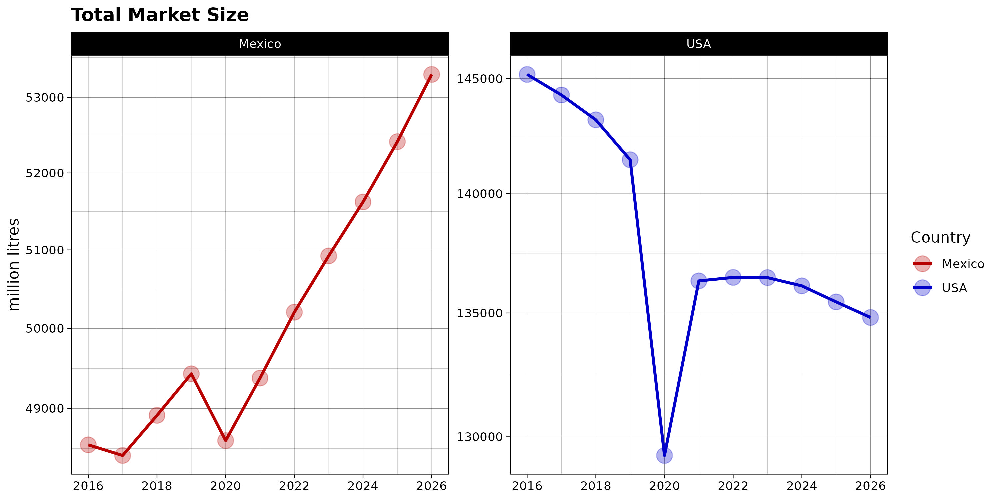
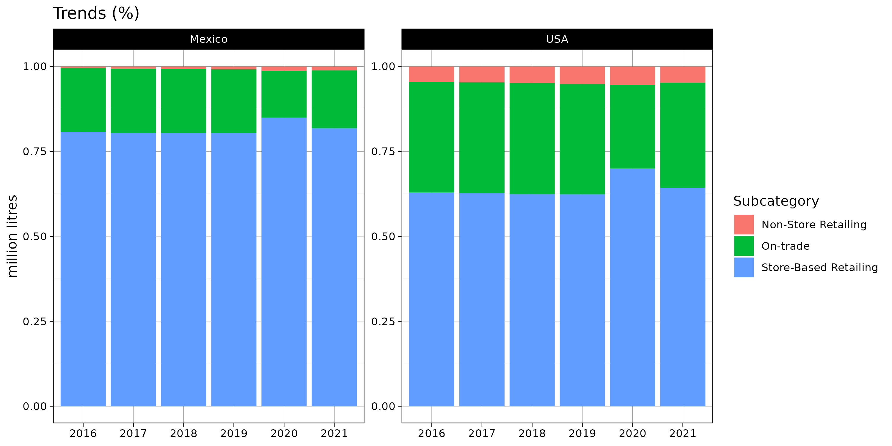
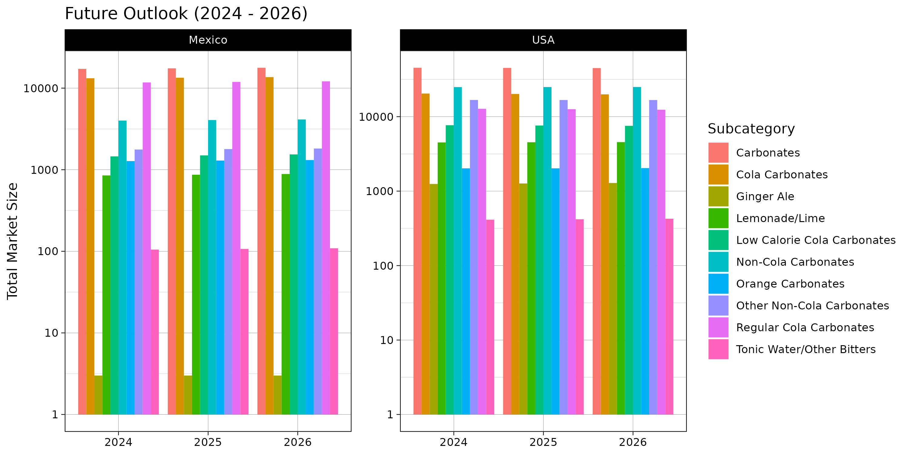
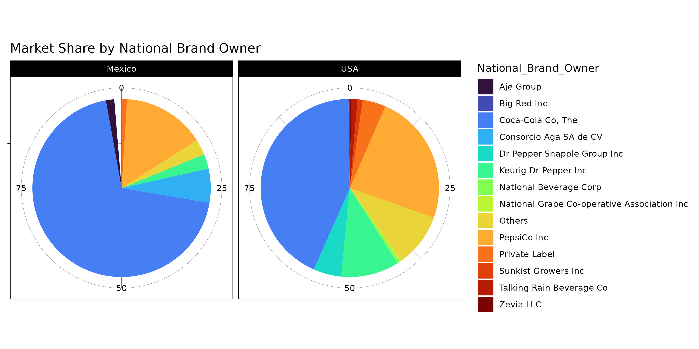

# EuromonitorTest
> "Information is the oil of the 21st century, and analytics is the combustion engine."  
> — Peter Sondergaard (Gartner IT Symposium/Xpo, October 2011).

The intelligent collection, cleaning, processing and visualization of data is an indispensable process for the efficient, precise, productive and sharp **self-criticism** of any project.

> [!CAUTION]
> Certain data files, specifically those with the extension .xlsx, are not intended to be open-sourced. These files may contain proprietary or sensitive information and are subject to restrictions.
> - Do not open source, distribute, or reproduce any files with the .xlsx extension without explicit permission from Euromonitor International.
> - If you have questions or need clarification, please contact me at victorbenitogr@gmail.com.


## Clone Repository

To clone this repository to your local machine, follow these steps:

1. Open a terminal on your machine.

2. Navigate to the directory where you want to clone the repository using the `cd` command:

    ```bash
    cd path/to/your/directory
    ```

3. Copy the clone URL of this repository by clicking on the green "Code" button on the GitHub page and copying the URL.

4. In the terminal, use the `git clone` command to clone the repository:

    ```bash
    git clone https://github.com/VictorBenitoGR/EuromonitorTest.git
    ```

5. Open VSCode/RStudio and select the project folder.

6. You can find the main R file on ./src!

## Visualization

### Market Performance



### Trends



### Future outlook



### Competitive environment




